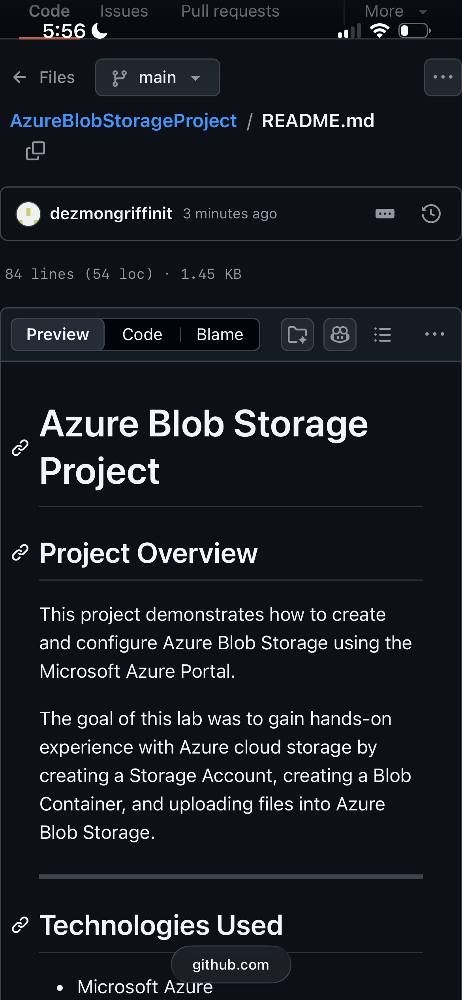
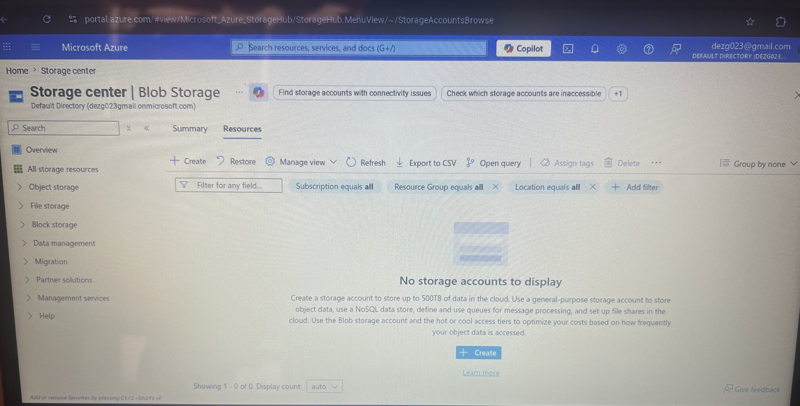
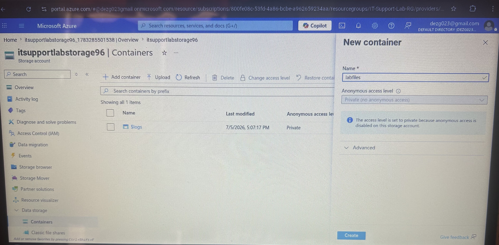
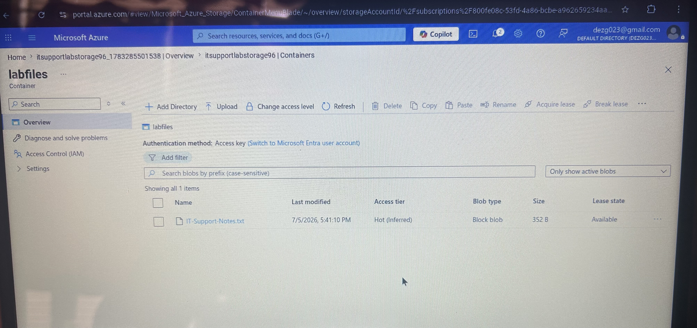

# Azure Blob Storage Project

## Project Overview

This project demonstrates how to create and configure Azure Blob Storage using the Microsoft Azure Portal.

The goal of this lab was to gain hands-on experience with Azure cloud storage by creating a Storage Account, creating a Blob Container, and uploading files into Azure Blob Storage.

---

## Technologies Used

- Microsoft Azure
- Azure Storage Account
- Azure Blob Storage
- Azure Resource Groups
- Azure Portal

---

## Skills Demonstrated

- Created an Azure Resource Group
- Configured an Azure Storage Account
- Created a private Blob Container
- Uploaded files to Azure Blob Storage
- Managed cloud storage resources
- Navigated the Azure Portal

---

## Project Steps

### Step 1
Created a Resource Group.

### Step 2
Created an Azure Storage Account.

### Step 3
Configured Blob Storage settings.

### Step 4
Created a Blob Container named **labfiles**.

### Step 5
Uploaded a text file into Azure Blob Storage.

---

## Outcome

Successfully deployed Azure Blob Storage and verified that uploaded files were accessible within the Blob Container.

---

## What I Learned

This project helped me understand:

- Azure Resource Groups
- Storage Accounts
- Blob Storage
- Containers
- Cloud file storage
- Basic Azure administration

---

## Screenshots

### Azure Blob Storage README

### Azure Storage Center

### Creating the Blob Container

### Uploaded Blob File

